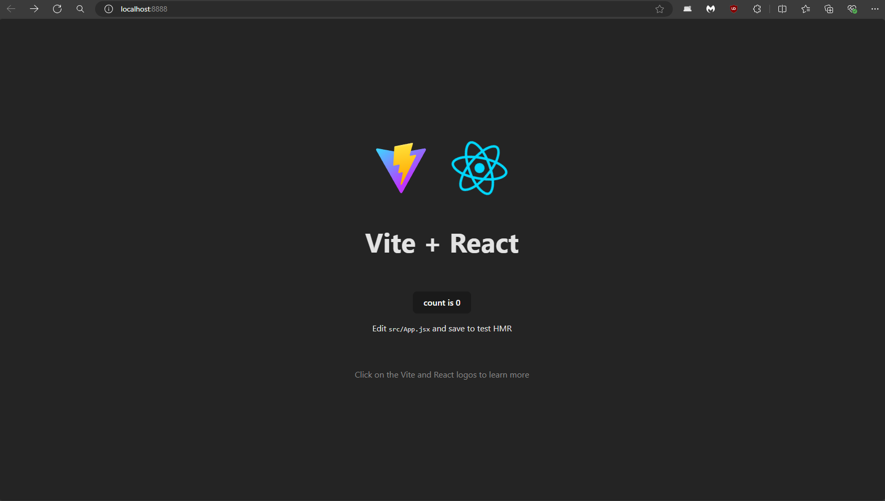
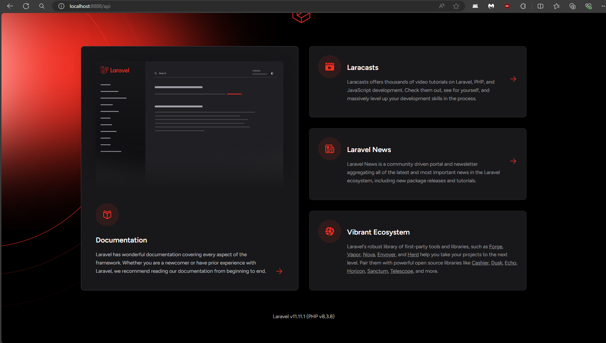

# React + Vite + PHP 8 + Laravel

## Screenshots




## PROXY SERVER INCLUDED
```
http://localhost:8888 -> VITE + REACT
http://localhost:8888/api -> PHP 8.3 + Laravel BACKEND
```

## Installation
## Installation script works only on Windows 

* use the installation script, install.ps1 (you will need to run as administrator)
```
powershell -ExecutionPolicy ByPass -File .\install.ps1
```
* After you done with the installation script close Powershell and open it again.

* <b>Install vendor packages</b>
```
composer install
```
* <b>Rename .env.template to .env and run the following</b>
```
php artisan key:generate
```
* <b>Copy database.sqlite to the database folder</b>
* <b>CD to /Startup Folder and Install NodeJS dependencies</b>
```
npm install
```


## RUN
To run the app CD to /Startup Folder
- It will run React + Vite
- Laravel also going to be run alongside React + Vite
```
npm run dev
```


This template provides a minimal setup to get React working in Vite with HMR and some ESLint rules.

Currently, two official plugins are available:

- [@vitejs/plugin-react](https://github.com/vitejs/vite-plugin-react/blob/main/packages/plugin-react/README.md) uses [Babel](https://babeljs.io/) for Fast Refresh
- [@vitejs/plugin-react-swc](https://github.com/vitejs/vite-plugin-react-swc) uses [SWC](https://swc.rs/) for Fast Refresh
